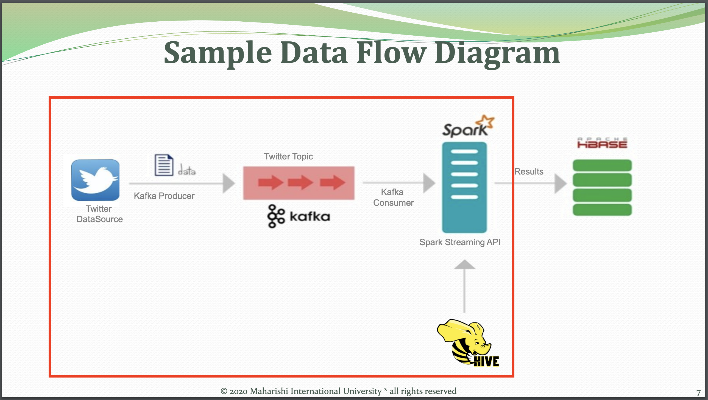
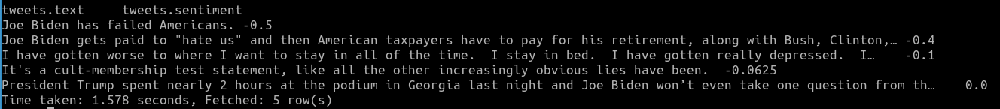
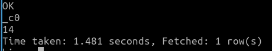
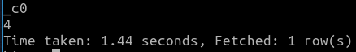
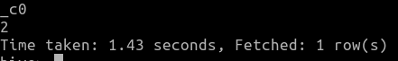

# miu-bdt-final-project
`Twitter API v2 -> Kafka -> Spark Streaming -> Hive`

This repo includes source of the final project implemented as a final project of CS523: Big Data Technology in Maharishi Internation University.


Topics:
* Overview
* Requirements
* Project detail

## Overview

> Spark Streaming - Sentiment Analysis

I implemented the sample flow diagram given in the final project instruction



Project Parts:
- **`[1]`** Create your own project for Spark Streaming
- **`[2]`** Integrate Hive with Part 1
- **`[3]`** Create a simple demo project for any of the following tools: Kafka
- **`[4]`** Record a demo of your Presentation of all the above 3 parts.

Things completed here:
- **`[1]`** Collect stream of tweets using `twitter API v2`
    - For example, filtered by `Joe Biden` and `Donald Trump` 
- **`[3]`** Use it as a producer to kafka topic `tweets`
- **`[1]`** Use spark streaming api to consume from the topic `tweets`
- **`[1]`** Implement sentiment analysis on tweet using `textblob` package during spark streaming
- **`[2]`** Then write it to `hive`
- **`[4]`** [Recorded demo]()

## Requirements

| Name | Version |
| - | - |
| Lubuntu | 20.04 |
| Python | 3.6.7 |
| Scala | 2.11.12 |
| Hadoop | 2.8.5 |
| Hive | 2.3.5 |
| Kafka (For Hadoop2) | 2.12 |
| Spark (For Hadoop2) | 3.1.2 |

Python requirements:

| Package | Version |
| - | - |
| pyspark | 2.4.3 |
| kafka-python | 1.4.6 |
| tweepy | 4.0.0 |

Download spark streaming to kafka util from 
https://search.maven.org/search?q=a:spark-streaming-kafka-0-8-assembly_2.11

Hive Installer
http://archive.apache.org/dist/hive/hive-2.3.5/

Spark for Hadoop2
https://www.apache.org/dyn/closer.lua/spark/spark-3.1.2/spark-3.1.2-bin-hadoop2.7.tgz

Kafka:
https://kafka.apache.org/downloads

Hadoop2
https://hadoop.apache.org/release/2.8.5.html


## Project detail:
### Start Zookeeper
```
bayartsogt@ubuntu:~/kafka$ bin/zookeeper-server-start.sh config/zookeeper.properties
```

### Start Kafka Broker
```
bayartsogt@ubuntu:~/kafka$ bin/kafka-server-start.sh config/server.properties
```
### Start Hive MetaStore 
```
bayartsogt@ubuntu:~$ hive --service metastore
```

### Create Hive Table
```
(general) bayartsogt@ubuntu:~$ hive
hive> show databases;
OK
default
Time taken: 1.09 seconds, Fetched: 1 row(s)
hive> use default;
OK
Time taken: 0.061 seconds
hive> CREATE TABLE tweets (text STRING, sentiment DOUBLE)
    > ROW FORMAT DELIMITED FIELDS TERMINATED BY '\\|'
    > STORED AS TEXTFILE;
OK
Time taken: 0.72 seconds
hive> show tables;
OK
tweets
Time taken: 0.066 seconds, Fetched: 1 row(s)
```
### Download nltk toolkit
```python
>>> import nltk
>>> nltk.download('brown')
[nltk_data] Downloading package brown to /home/bayartsogt/nltk_data...
[nltk_data]   Unzipping corpora/brown.zip.
True
```
### Start Twitter Producer

First go to `src` folder
```
cd ./src
```

Then run producer by following command:
```
python producer.py
```

Now we will submit the consumer script by following command:
```
spark-submit --jars spark-streaming-kafka-0-8-assembly_2.11-2.4.8.jar consumer.py
```


### Analyze using HIVE

1. Top 5 negative tweets
```
select * from tweets where sentiment > -2 order by sentiment limit 5;
```



2. Top 5 positive tweets
```
select * from tweets where sentiment > -2 order by sentiment desc limit 5;
```


3. Total `NOT NULL` tweets:
```
select count(*) from tweets where sentiment > -2;
```



4. Number of negative tweets
```
select count(*) from tweets where sentiment > -2 and sentiment < 0;
```


5. Number of positive tweets
```
select count(*) from tweets where sentiment > -2 and sentiment > 0;
```


### Further improvement:
- Improve sentiment analysis prediction: `spark-nlp` integration
- Collect more features (right now only tweet attribute)
- Comprehensive dashboard for further audience